# 🐾 GATODS 🐾

**GATODS** es un juego de plataformas donde el jugador elige entre un gato o una gata para embarcarse en una misión ecológica. A través de escenarios mágicos como el bosque, la ciudad y la montaña, el protagonista debe realizar acciones sustentables para evitar un futuro devastador donde el entorno ha sido destruido.

---

## 🌟 Características

🎨 Menús animados con transiciones suaves
  - 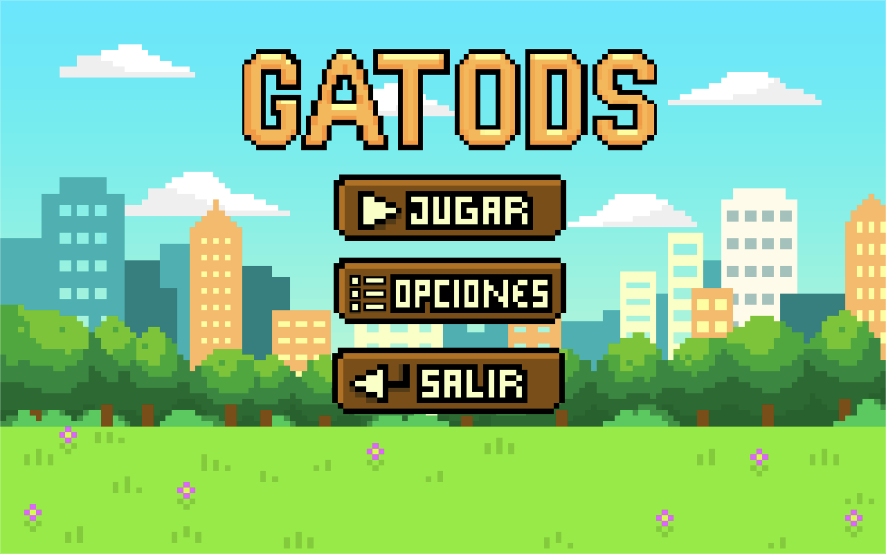      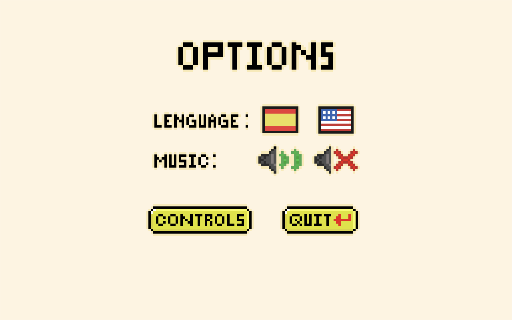

  - 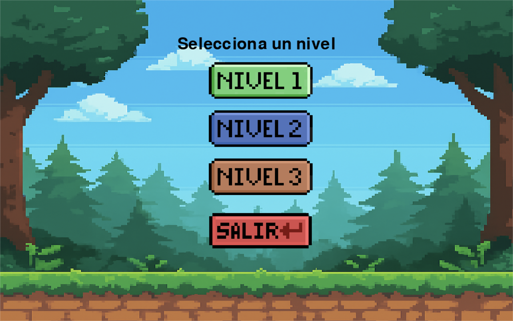      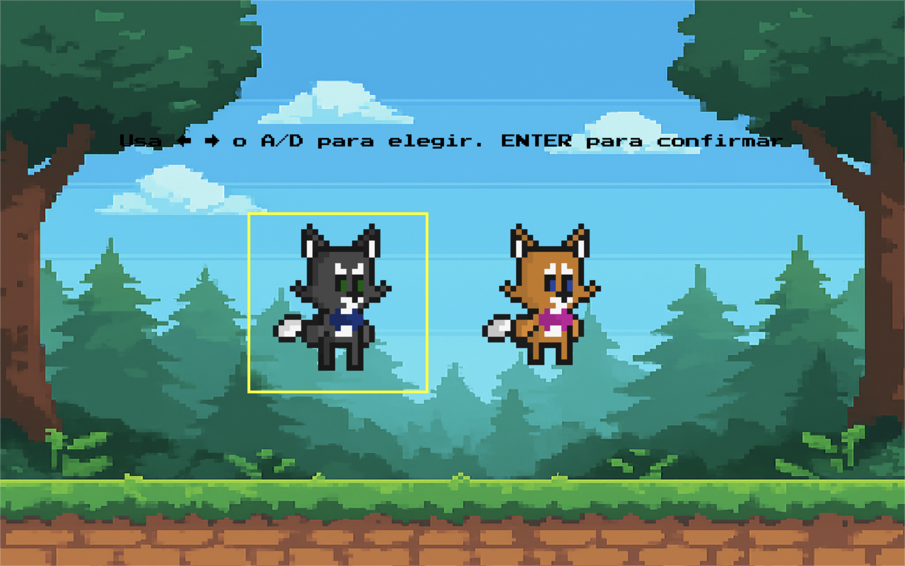
    
  - 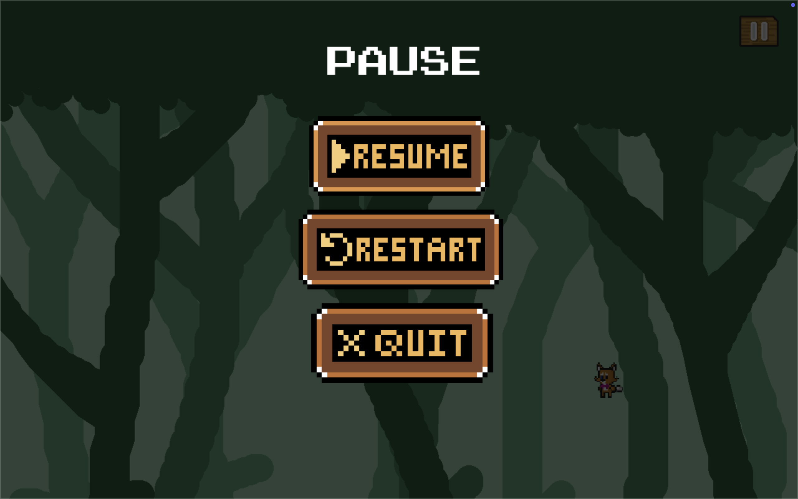
    
🌍 Sistema bilingüe dinámico (Español / Inglés) "En progreso" 
- 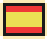      
  
  🐱 Elección de personaje: gato o gata
- 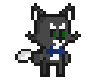      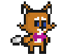
  
🏞️ Niveles temáticos: bosque, ciudad y montaña
- 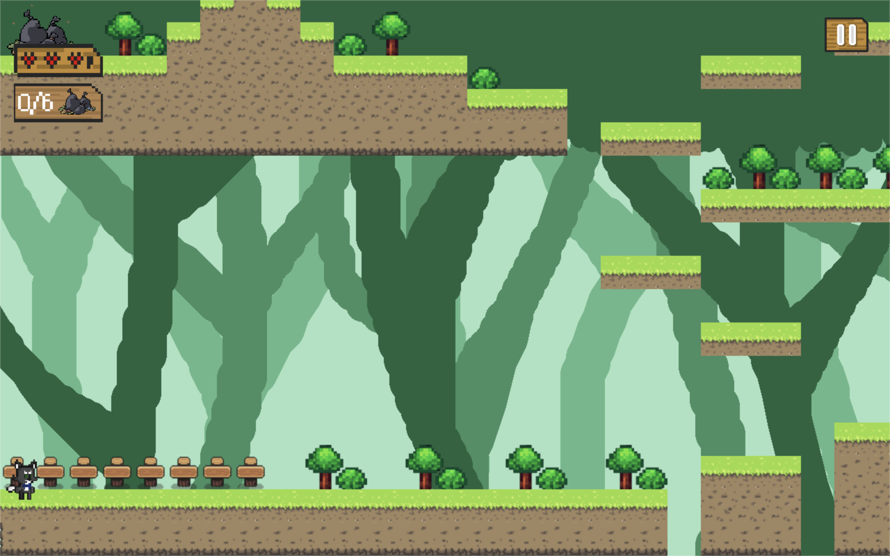    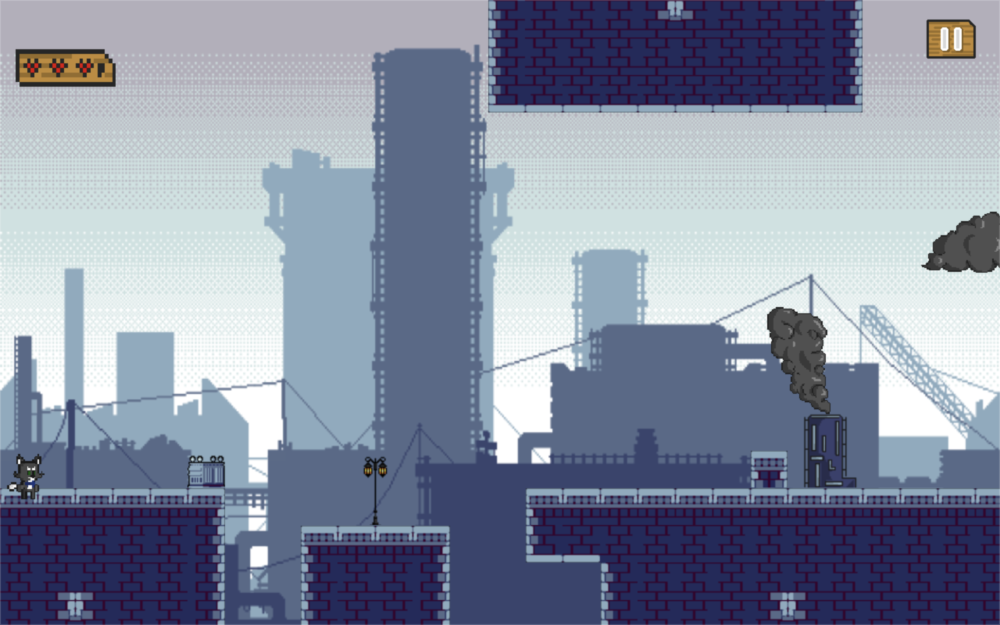  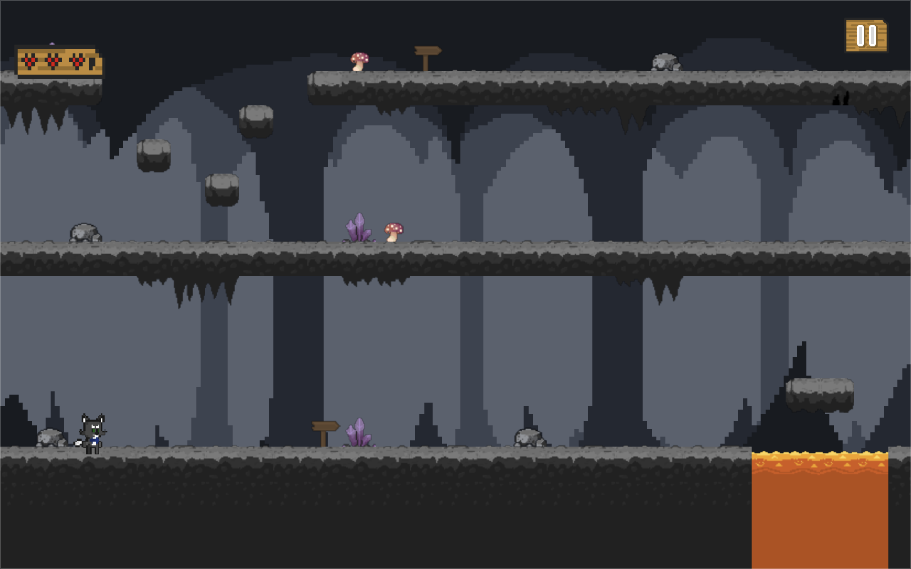
  

🎵 Música ambiental y efectos sonoros personalizados

✨ Visuales coloridos y estilo pixel art

🧩 Diseño modular para escalabilidad y mantenimiento

---

## 🛠️ Tecnologías utilizadas

- [Pygame](https://www.pygame.org/) — Motor principal del juego
- [Tiled](https://www.mapeditor.org/) — Diseño de niveles
- [LibreSprite](https://libresprite.github.io/) — Creación de sprites y animaciones
- Visual Studio Code — Entorno de desarrollo
- Pixel Studio — Creacion de fondos y elementos

---

## 🕹️ Controles

**← / →** y **a / d**: Mover al personaje
- 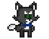      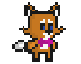
  
**Espacio** y **w**: Saltar
-       

**Mouse**: Navegar por los botones
- 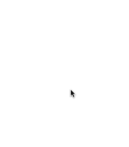

**ESC / Cerrar ventana**: Salir del juego
- 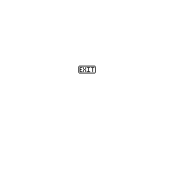

Instalación rápida:

```bash
pip install pygame pytmx
